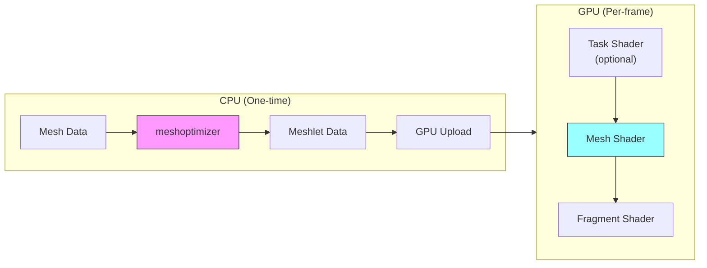

# Mesh Shaders & Meshlet Rendering

Soul Engine supports GPU-driven mesh shader rendering using `VK_EXT_mesh_shader`. Meshlet-based rendering allows the GPU to perform fine-grained culling and reduces CPU overhead compared to traditional vertex/index buffer pipelines.

## Overview



### Key Benefits

- **GPU-driven culling** — Frustum and backface culling in compute-like task shaders
- **Reduced CPU overhead** — Single draw call per mesh regardless of complexity
- **Better cache utilization** — Meshlets are optimized for vertex reuse
- **Flexible LOD** — Task shaders can select LOD per-meshlet

## Data Structures

### Meshlet (12 bytes)

```cpp
struct Meshlet {
    uint32_t vertexOffset;     // Offset into meshlet vertex indices
    uint32_t triangleOffset;   // Byte offset into packed triangle buffer
    uint8_t  vertexCount;      // Vertices in this meshlet (max 64)
    uint8_t  triangleCount;    // Triangles in this meshlet (max 124)
    uint16_t _padding;
};
```

### MeshletBounds (32 bytes)

```cpp
struct MeshletBounds {
    float3 center;      // Bounding sphere center
    float  radius;      // Bounding sphere radius
    float3 coneAxis;    // Normalized average normal direction
    float  coneCutoff;  // cos(cone_half_angle) for backface culling
};
```

### Memory Layout

```
┌──────────────────────────────────────────────────────────┐
│                    Vertex Buffer                         │
│  [V0][V1][V2]...[Vn]  (48 bytes per vertex)             │
└──────────────────────────────────────────────────────────┘

┌──────────────────────────────────────────────────────────┐
│               Meshlet Vertex Indices                     │
│  [uint32][uint32]...  (indices into vertex buffer)       │
└──────────────────────────────────────────────────────────┘

┌──────────────────────────────────────────────────────────┐
│               Meshlet Triangle Indices                   │
│  [u8,u8,u8][u8,u8,u8]...  (3 bytes per triangle)        │
│  (local indices into meshlet's vertex list)              │
└──────────────────────────────────────────────────────────┘

┌──────────────────────────────────────────────────────────┐
│                   Meshlet Descriptors                    │
│  [Meshlet][Meshlet]...  (12 bytes each)                 │
└──────────────────────────────────────────────────────────┘

┌──────────────────────────────────────────────────────────┐
│                   Meshlet Bounds                         │
│  [Bounds][Bounds]...  (32 bytes each)                   │
└──────────────────────────────────────────────────────────┘
```

## Usage

### Generating Meshlets (CPU)

```cpp
#include <synodic.soul.render.mesh>

using namespace synodic::soul::mesh;

// From mesh data
MeshletData meshletData = GenerateMeshlets(meshData, MeshletOptions{
    .maxVertices = 64,
    .maxTriangles = 124,
    .coneWeight = 0.5f  // Balance between size and culling quality
});

// From raw vertex/index data
MeshletData meshletData = GenerateMeshletsRaw(
    positions,        // float* to position data
    positionStride,   // Bytes between positions (e.g., 48 for PBR vertex)
    vertexCount,
    indices,
    indexCount,
    options
);
```

### Uploading to GPU

```cpp
GPUMeshletMesh gpuMesh = UploadMeshletMesh(device, meshData, meshletData);

// gpuMesh contains:
// - vertexBuffer / vertexBufferGPU
// - meshletBuffer / meshletBufferGPU
// - boundsBuffer / boundsBufferGPU
// - vertexIndexBuffer / vertexIndexBufferGPU
// - primitiveIndexBuffer / primitiveIndexBufferGPU
// - meshletCount
```

### Drawing with Mesh Shaders

```cpp
// Prepare GPU pointer data
GPUMeshShaderData gpuData{
    .vertices = gpuMesh.vertexBufferGPU,
    .meshletVertices = gpuMesh.vertexIndexBufferGPU,
    .meshletTriangles = gpuMesh.primitiveIndexBufferGPU,
    .meshlets = gpuMesh.meshletBufferGPU,
    .meshletBounds = gpuMesh.boundsBufferGPU,
    .instance = instanceBufferGPU,
    .meshletCount = gpuMesh.meshletCount
};

// Push constants with GPU pointers
PushConstants push{
    .meshData = uploadBuffer.GetGPUAddress(&gpuData),
    .pixelData = uploadBuffer.GetGPUAddress(&pbrData)
};

// Dispatch mesh shaders
vkCmdPushConstants(cmd, layout, VK_SHADER_STAGE_ALL, 0, sizeof(push), &push);
vkCmdDrawMeshTasksEXT(cmd, gpuMesh.meshletCount, 1, 1);
```

## Shader Implementation

### Mesh Shader (Slang)

```slang
#include "meshlet_common.slang"

[outputtopology("triangle")]
[numthreads(MESH_WORKGROUP_SIZE, 1, 1)]
[shader("mesh")]
void meshMain(
    uint gtid : SV_GroupThreadID,
    uint gid : SV_GroupID,
    out vertices MeshOutput verts[MAX_VERTICES_PER_MESHLET],
    out indices uint3 tris[MAX_PRIMITIVES_PER_MESHLET])
{
    MeshShaderData meshData = *root.meshData;
    
    // One workgroup per meshlet
    uint meshletIndex = gid;
    if (meshletIndex >= meshData.meshletCount)
    {
        SetMeshOutputCounts(0, 0);
        return;
    }
    
    Meshlet meshlet = meshData.meshlets[meshletIndex];
    SetMeshOutputCounts(meshlet.vertexCount, meshlet.triangleCount);
    
    // Process vertices cooperatively
    for (uint vi = gtid; vi < meshlet.vertexCount; vi += MESH_WORKGROUP_SIZE)
    {
        uint vertexIndex = meshData.meshletVertices[meshlet.vertexOffset + vi];
        MeshVertex vertex = LoadMeshVertex(meshData.vertices, vertexIndex);
        // Transform and output...
    }
    
    // Barrier ensures vertices are written before triangles read them
    GroupMemoryBarrierWithGroupSync();
    
    // Process triangles cooperatively
    for (uint ti = gtid; ti < meshlet.triangleCount; ti += MESH_WORKGROUP_SIZE)
    {
        tris[ti] = UnpackTriangle(meshData.meshletTriangles, meshlet.triangleOffset, ti);
    }
}
```

### Triangle Unpacking

Triangles are packed as 3 bytes each (local vertex indices 0-63). The `UnpackTriangle` function handles byte extraction across 32-bit word boundaries:

```slang
uint3 UnpackTriangle(uint* triangleBuffer, uint triangleOffset, uint triangleIndex)
{
    uint byteOffset = triangleOffset + triangleIndex * 3;
    uint wordOffset = byteOffset / 4;
    uint byteInWord = byteOffset % 4;
    
    uint word0 = triangleBuffer[wordOffset];
    uint3 indices;
    
    if (byteInWord == 0)
    {
        indices.x = word0 & 0xFF;
        indices.y = (word0 >> 8) & 0xFF;
        indices.z = (word0 >> 16) & 0xFF;
    }
    else if (byteInWord == 1)
    {
        indices.x = (word0 >> 8) & 0xFF;
        indices.y = (word0 >> 16) & 0xFF;
        indices.z = (word0 >> 24) & 0xFF;
    }
    else if (byteInWord == 2)
    {
        uint word1 = triangleBuffer[wordOffset + 1];
        indices.x = (word0 >> 16) & 0xFF;
        indices.y = (word0 >> 24) & 0xFF;
        indices.z = word1 & 0xFF;
    }
    else // byteInWord == 3
    {
        uint word1 = triangleBuffer[wordOffset + 1];
        indices.x = (word0 >> 24) & 0xFF;
        indices.y = word1 & 0xFF;
        indices.z = (word1 >> 8) & 0xFF;
    }
    
    return indices;
}
```

## Vulkan Requirements

### Required Features

```cpp
// Vulkan 1.2 features
VkPhysicalDeviceVulkan12Features vulkan12{};
vulkan12.shaderInt8 = VK_TRUE;                 // uint8_t in shaders
vulkan12.storageBuffer8BitAccess = VK_TRUE;    // 8-bit buffer access

// Vulkan 1.3 features (maintenance4)
VkPhysicalDeviceVulkan13Features vulkan13{};
vulkan13.maintenance4 = VK_TRUE;               // Required for mesh shaders

// Mesh shader features
VkPhysicalDeviceMeshShaderFeaturesEXT meshShaderFeatures{};
meshShaderFeatures.meshShader = VK_TRUE;
meshShaderFeatures.taskShader = VK_TRUE;       // Optional but recommended
```

### Required Extensions

- `VK_EXT_mesh_shader` — Core mesh shader functionality
- `VK_KHR_spirv_1_4` — SPIR-V 1.4 for mesh shader support

## Performance Considerations

### Meshlet Sizing

| Vendor | Recommended Max Vertices | Recommended Max Triangles |
|--------|-------------------------|---------------------------|
| NVIDIA | 64 | 124 |
| AMD    | 64 | 124 |
| Intel  | 64 | 124 |

The engine defaults (64 vertices, 124 triangles) work well across all vendors.

### Culling Efficiency

- **Cone weight** (0.0-1.0): Higher values produce better culling cones but may create smaller meshlets
- **Task shader culling**: For complex scenes, implement frustum/occlusion culling in task shaders

### Memory vs Performance Trade-off

```
Traditional:  vertex_count * vertex_size + index_count * 4 bytes
Meshlet:      vertex_count * vertex_size + meshlet overhead
              (meshlet_count * 44 bytes + vertex_indices + triangle_indices)
```

Meshlet overhead is typically 5-15% additional memory but enables significant GPU-side optimizations.

## Debug Visualization

To visualize meshlet boundaries, use a per-meshlet color in the fragment shader:

```slang
// In mesh shader output
uint meshletIndex : MESHLET_INDEX;

// In fragment shader
float3 meshletColor = float3(
    frac(float(meshletIndex) * 0.381966),
    frac(float(meshletIndex) * 0.618034),
    frac(float(meshletIndex) * 0.723607)
);
```

## Limitations

- **Minimum Vulkan version**: 1.3 with `VK_EXT_mesh_shader`
- **macOS/MoltenVK**: Not supported (no mesh shader extension)
- **Older GPUs**: Requires Turing+ (NVIDIA), RDNA2+ (AMD), or Xe+ (Intel)

## Related Documentation

- [Shader Architecture](shader-architecture.md) — Shader compilation and reflection
- [Render Graph](render-graph.md) — Frame graph integration
