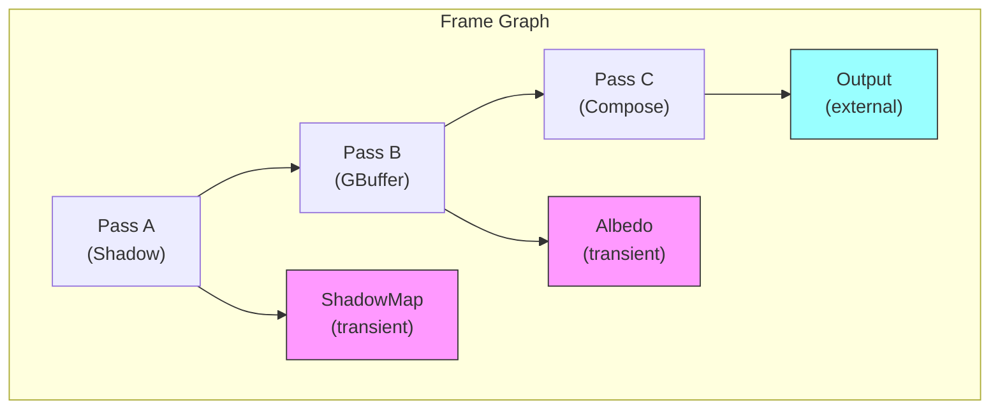
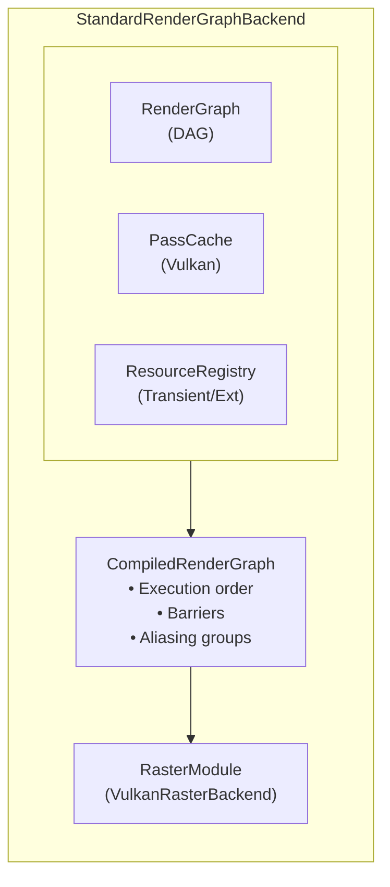

# Render Graph

Soul Engine uses a **frame graph** (render graph) system to declare and execute rendering operations. The graph handles dependency tracking, resource lifetime management, automatic synchronization, and performance optimizations like pass merging and memory aliasing.

## Overview



### Key Features

- **Automatic dependency resolution** — passes execute in topological order based on resource usage
- **Pass merging** — compatible render passes are merged into Vulkan subpasses for tiled GPU efficiency
- **Resource aliasing** — transient resources with non-overlapping lifetimes share backing memory
- **Barrier insertion** — synchronization barriers are automatically placed between passes
- **Runtime modifiable** — graph structure can be changed at runtime (editor support)

> **Note**: Currently using runtime graph construction. Compile-time graph via `#embed` planned for when compiler support is available.

## Quick Start

```cpp
#include <synodic.soul.render.graph>
#include <synodic.soul.render.graph.backend.standard>

// In your app's render function:
void RenderFrame() {
    auto& renderGraph = GetSoul().RenderGraph();
    
    // 1. Begin a new frame (clears previous graph)
    renderGraph.BeginFrame();
    
    // 2. Import external resources (e.g., swapchain surface)
    ResourceHandle surface = renderGraph.ImportSurface(surfaceEntity_);
    
    // 3. Build passes using fluent API
    auto mainPass = RenderPassBuilder("MainPass")
        .ColorOutput(surface, ResourceUsage::Present)
        .ClearColor(0.0f, 0.0f, 0.2f, 1.0f)
        .Build();
    
    renderGraph.AddPass(std::move(mainPass));
    
    // 4. Execute (compile + run)
    renderGraph.Execute(surfaceEntity_, surfaceSize_);
    
    // 5. Present
    renderGraph.Present();
}
```

## Resource Types

### External Resources

Resources that exist outside the frame graph (surfaces, persistent buffers):

```cpp
// Import a swapchain surface
ResourceHandle surface = renderGraph.ImportSurface(surfaceEntity);

// Import other external resources
ResourceHandle texture = frameGraph.ImportExternal(textureEntity, true, Format::RGBA);
```

### Transient Resources

Resources that only exist within a single frame. The graph automatically manages their lifetime and can alias memory between non-overlapping resources:

```cpp
auto& graph = renderGraph.FrameGraph();

// Create a transient render target
TransientImageDesc gbufferDesc;
gbufferDesc.width = 1920;
gbufferDesc.height = 1080;
gbufferDesc.format = Format::RGBA;
ResourceHandle gbuffer = graph.CreateTransientImage(gbufferDesc);

// Create a transient buffer
TransientBufferDesc bufferDesc;
bufferDesc.size = 1024 * 1024;
bufferDesc.type = BufferType::Storage;
ResourceHandle buffer = graph.CreateTransientBuffer(bufferDesc);
```

## Building Passes

### RenderPassBuilder

Fluent API for creating rasterization passes:

```cpp
auto shadowPass = RenderPassBuilder("ShadowPass")
    .DepthStencilOutput(shadowMap)           // Depth-only output
    .ClearDepth(1.0f)
    .Build();

auto gbufferPass = RenderPassBuilder("GBufferPass")
    .ColorOutput(albedo)                      // Color attachment 0
    .ColorOutput(normal)                      // Color attachment 1
    .DepthStencilOutput(depth)
    .ClearColor(0.0f, 0.0f, 0.0f, 1.0f)
    .Build();

auto compositePass = RenderPassBuilder("CompositePass")
    .SampledInput(albedo)                     // Read as sampled texture
    .SampledInput(shadowMap)
    .ColorOutput(surface, ResourceUsage::Present)
    .LoadPrevious()                           // Don't clear, load existing content
    .Build();
```

### ComputePassBuilder

For compute shader dispatches:

```cpp
auto cullingPass = ComputePassBuilder("FrustumCulling")
    .Input(sceneBuffer)
    .Output(visibleBuffer)
    .Dispatch(numObjects / 64, 1)
    .Build();
```

## Resource Usage Flags

Declare how each pass uses resources for automatic barrier insertion:

| Flag | Description |
|------|-------------|
| `VertexShaderRead` | Read in vertex shader |
| `FragmentShaderRead` | Read/sample in fragment shader |
| `ComputeShaderRead` | Read in compute shader |
| `ComputeShaderWrite` | Write in compute shader (UAV) |
| `ColorAttachmentWrite` | Write as color attachment |
| `DepthStencilRead` | Read depth/stencil |
| `DepthStencilWrite` | Write depth/stencil |
| `TransferSource` | Copy source |
| `TransferDest` | Copy destination |
| `Present` | Present to swapchain |

```cpp
// Combine flags with |
.ColorOutput(surface, ResourceUsage::ColorAttachmentWrite | ResourceUsage::Present)
```

## Graph Compilation

When `Execute()` is called, the graph is compiled:

```cpp
const CompiledRenderGraph& compiled = frameGraph.Compile();

// Compilation produces:
compiled.executionOrder;   // Topologically sorted pass indices
compiled.mergedGroups;     // Passes merged into Vulkan subpasses  
compiled.aliasingGroups;   // Resources sharing memory
compiled.barriers;         // Required synchronization barriers
compiled.isValid;          // False if graph has cycles
```

### Pass Merging

Render passes are automatically merged into Vulkan subpasses when:

1. Both are raster passes
2. Second pass reads from first pass's output (input attachment pattern)
3. Both have compatible render areas
4. No external dependencies break the merge

This significantly improves performance on tiled GPUs (mobile, Apple Silicon).

### Resource Aliasing

Transient resources with non-overlapping lifetimes share backing memory:

```
Pass A writes to Temp1 (frames 0-2)
Pass B writes to Temp2 (frames 3-5)
→ Temp1 and Temp2 can share the same VkDeviceMemory
```

## Execution Callbacks

Register callbacks for custom rendering logic within a pass:

```cpp
renderGraph.AddPassWithCallback(
    RenderPassBuilder("CustomPass")
        .ColorOutput(target)
        .Build(),
    [](PassExecutionContext& ctx) {
        // Access command list for custom draw commands
        CommandList& cmd = ctx.commands;
        // ctx.renderArea gives you the render target size
        // ctx.surfaceTarget gives you the target resource handle
    }
);
```

## Integration with Raster Backend

The render graph internally uses the `RasterModule` for Vulkan operations:

```cpp
// Initialize render graph with raster backend (once at startup)
GetSoul().RenderGraph().Initialize(&GetSoul().Raster());
```

The graph manages:
- Vulkan render pass creation and caching
- Surface attachment
- Command buffer recording
- Synchronization (timeline semaphores, barriers)

## Multi-Pass Example

```cpp
void RenderFrame() {
    auto& rg = GetSoul().RenderGraph();
    auto& graph = rg.FrameGraph();
    
    rg.BeginFrame();
    
    // Import swapchain
    ResourceHandle backbuffer = rg.ImportSurface(surface_);
    
    // Create transient GBuffer
    TransientImageDesc desc{1920, 1080, Format::RGBA};
    ResourceHandle albedo = graph.CreateTransientImage(desc);
    ResourceHandle normal = graph.CreateTransientImage(desc);
    
    desc.depthStencil = true;
    ResourceHandle depth = graph.CreateTransientImage(desc);
    
    // GBuffer pass
    rg.AddPass(RenderPassBuilder("GBuffer")
        .ColorOutput(albedo)
        .ColorOutput(normal)
        .DepthStencilOutput(depth)
        .ClearColor(0, 0, 0, 1)
        .ClearDepth(1.0f)
        .Build());
    
    // Lighting pass (reads GBuffer, writes to backbuffer)
    rg.AddPass(RenderPassBuilder("Lighting")
        .SampledInput(albedo)
        .SampledInput(normal)
        .SampledInput(depth)
        .ColorOutput(backbuffer, ResourceUsage::Present)
        .Build());
    
    // Execute all passes in dependency order
    rg.Execute(surface_, {1920, 1080});
    rg.Present();
}
```

## Architecture



## Files

| File | Description |
|------|-------------|
| `src/render/graph/graph.ixx` | Core `RenderGraph` class with compilation |
| `src/render/graph/pass.ixx` | `RenderPassDesc`, `ComputePassDesc`, resource types |
| `src/render/graph/resource.ixx` | `ResourceRegistry`, transient/external resources |
| `src/render/graph/builder.ixx` | `RenderPassBuilder`, `ComputePassBuilder` |
| `src/render/graph/backend/standard/standard.ixx` | `StandardRenderGraphBackend` implementation |

## Future Plans

- **Compile-time graphs** — Use `#embed` and `StaticStorage` for zero-overhead graph construction
- **Async compute** — Overlap compute and graphics work
- **Multi-queue** — Utilize transfer and compute queues
- **VMA integration** — Proper transient resource allocation with aliasing
- **Hot reload** — Editor support for live graph modification
